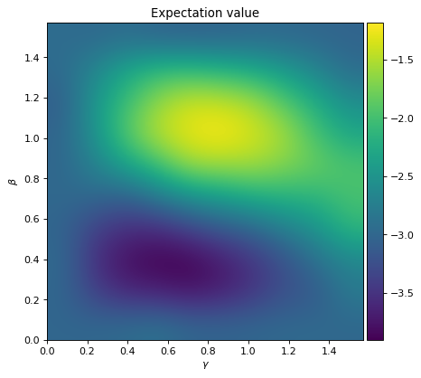

# QAOA

This package is a flexible python implementation of the [Quantum Approximate Optimization Algorithm](https://arxiv.org/pdf/1411.4028.pdf) /[Quantum Alternating Operator ansatz](https://arxiv.org/pdf/1709.03489.pdf)  (QAOA) **aimed at researchers** to readily test the performance of a new ansatz, a new classical optimizers, etc. By default it uses qiskit as a backend.

Install with `pip install qaoa` or `pip install -e .`.

***
### Background
Given a **cost function** 
$$c: \lbrace 0, 1\rbrace^n \rightarrow \mathbb{R}$$
one defines a **problem Hamiltonian** $H_P$ through the action on computational basis states via

$$ H_P |x\rangle = c(x) |x\rangle,$$

which means that ground states minimize the cost function $c$.
Given a parametrized ansatz $ | \gamma, \beta \rangle$, a classical optimizer is used to minimize the energy

$$ \langle \gamma, \beta | H_P | \gamma, \beta \rangle.$$

QAOA of depth $p$ consist of the following **ansatz**:

$$ |\gamma, \beta \rangle = \prod_{l=1}^p \left( U_M(\beta_l) U_P(\gamma_l)\right) | s\rangle, $$

where

- $U_P$ is a family of **phase**-separating operators,
- $U_M$ is a family of **mixing** operators, and
- $|s\rangle$ is a "simple" **initial** state.

In plain vanilla QAOA these have the form
$U_M(\beta_l)=e^{-i\beta_l X^{\otimes n}}$,  $U_P(\gamma_l)=e^{-i\gamma_l H_P}$, and the uniform superposition $| s \rangle = |+\rangle^{\otimes n}$ as initial state.

***
### Create a custom ansatz

In order to create a custom QAOA ansatz, one needs to specify a [problem](qaoa/problems/base_problem.py), a [mixer](qaoa/mixers/base_mixer.py), and an [initial state](qaoa/initialstates/base_initialstate.py). These base classes have an abstract method `def create_circuit:`which needs to be implemented. The problem base class additionally has an abstract method `def cost:`.

This library already contains several standard implementations.

- The following [problem](qaoa/problems/base_problem.py) cases are already available:
	- [MaxCut](qaoa/problems/maxcut_problem.py)
	- [QUBO](qaoa/problems/qubo_problem.py)
	- [Exact cover](qaoa/problems/exactcover_problem.py)
	- [Portfolio](qaoa/problems/portfolio_problem.py)
- The following [mixer](qaoa/mixers/base_mixer.py) cases are already available:
	- [X-mixer](qaoa/mixers/x_mixer.py)
	- [XY-mixer](qaoa/mixers/xy_mixer.py)
	- [Grover-mixer](qaoa/mixers/grover_mixer.py)
- The following [initial state](qaoa/initialstates/base_initialstate.py) cases are already available:
	- [Plus](qaoa/initialstates/plus_initialstate.py)
	- [Statevector](qaoa/initialstates/statevector_initialstate.py)
	- [Dicke](qaoa/initialstates/dicke_initialstate.py)

It is **very easy to extend this list** by providing  an implementation of a circuit/cost of the base classes mentioned above. Feel free to fork the repo and create a pull request :-)

To make an ansatz for the MaxCut problem, the X-mixer and the initial state $|+\rangle^{\otimes n}$  one can create an instance like this: 

	qaoa = QAOA(
		initialstate=initialstates.Plus(),
		problem=problems.MaxCut(G="some networkx instance"),
		mixer=mixers.X()
	)

***
### Run optimization at depth $p$

For depth $p=1$ the expectation value can be sampled on an $n\times m$ Cartesian grid over the domain $[0,\gamma_\text{max}]\times[0,\beta_\text{max}]$ with:
		
	qaoa.sample_cost_landscape()
	

Sampling high-dimensional target functions quickly becomes intractable for depth $p>1$. We therefore **iteratively increase the depth**. At each depth a **local optimization** algorithm, e.g. COBYLA, is used to find a local minimum. As **initial guess** the following is used:

- At depth $p=1$ initial parameters $(\gamma, \beta)$ are given by the lowest value of the sampled cost landscape. 
- At depth $p>1$ initial parameters $(\gamma, \beta)$ are based on an [interpolation-based heuristic](https://arxiv.org/pdf/1812.01041.pdf) of the optimal values at the previous depth.

Running this iterative local optimization to depth $p$ can be done by the following call:

	qaoa.optimize(depth=p)

The function will call `sample_cost_landscape` if not already done, before iteratively increasing the depth.

***
### Further parameters

QAOA supports the following keywords:

	qaoa = QAOA( ...,
		backend= ,
		noisemodel= ,
		optimizer= ,
		precision= ,
		shots= ,
		alpha=
	)

- `backend`: the backend to be used, defaults to `Aer.get_backend("qasm_simulator")`
- `noisemodel`: the noise model to be used, default to `None`,
- `optimizer`: a list of the optimizer to be used from qiskit-algorithms together with options, defaults to `[COBYLA, {}]`,
- `precision`: sampel until a certain precision of the expectation value is reached based on $\text{error}=\frac{\text{variance}}{\sqrt{\text{shots}}}$, defaults to `None`,
- `shots`: number of shots to be used, defaults to `1024`,
- `alpha`: the value for [conditional value at risk (CVAR)](https://arxiv.org/pdf/1907.04769.pdf), defaults to `1`, which are the standard moments.

***
### Extract results

Once `qaoa.optimize(depth=p)` is run, one can extract, the expectation value, variance, and parametres for each depth $1\leq i \leq p$ by respectively calling:

	qaoa.get_Exp(depth=i)
	qaoa.get_Var(depth=i)
	qaoa.get_gamma(depth=i)
	qaoa.get_beta(depth=i)

Additionally, for each depth every time the loss function is called, the **angles, expectation value, variance, maximum cost, minimum cost, **and** number of shots** are stored in 

	qaoa.optimization_results[i]

***
### Example usage

See [examples here](examples/).
