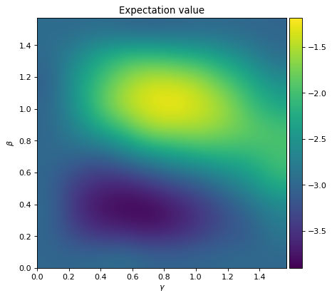
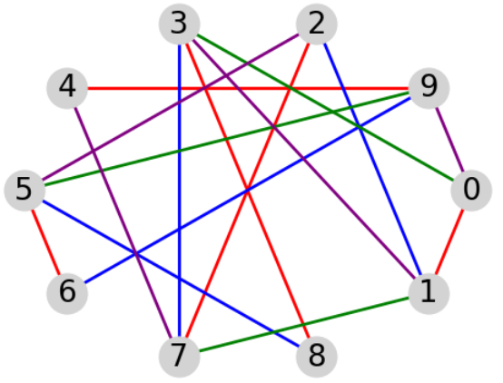
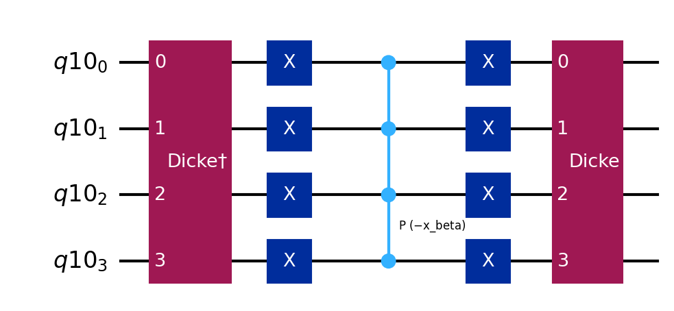
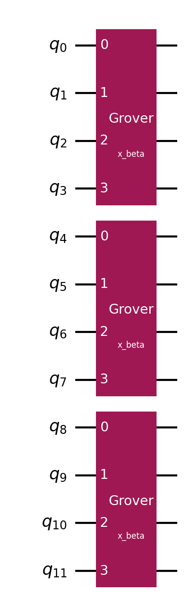
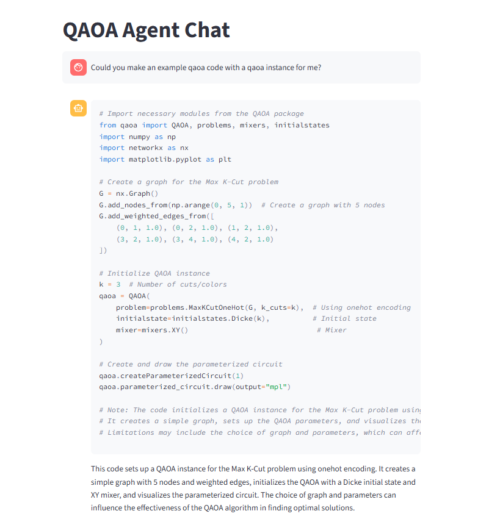

# QAOA

[](https://pypi.org/project/qaoa/)
[](https://pypi.org/project/qaoa/)
[](LICENSE)

A flexible, modular Python library for the [Quantum Approximate Optimization Algorithm](https://arxiv.org/pdf/1411.4028.pdf) / [Quantum Alternating Operator Ansatz](https://arxiv.org/pdf/1709.03489.pdf) (QAOA), **designed for research and experimentation**. Swap problems, mixers, initial states, optimizers, and backends without rewriting your code.

---

## Table of Contents

- [Installation](#installation)
- [Requirements](#requirements)
- [Quick Example](#quick-example)
- [Background](#background)
- [Custom Ansatz](#custom-ansatz)
- [Running Optimization](#running-optimization-at-depth-p)
- [Further Parameters](#further-parameters)
- [Extracting Results](#extract-results)
- [Multi-Angle QAOA](#multi-angle-qaoa)
- [Fixing One Node to Reduce Circuit depth/width](#fixing-one-node-to-reduce-circuit-size)
- [Bit-Flip Boosting](#bit-flip-boosting)
- [Building Circuits like Lego](#building-circuits-like-lego)
- [Minimizing Circuit Depth](#minimizing-depth-of-phase-separating-operator)
- [Repository Structure](#repository-structure)
- [Agent](#talk-to-an-agent)
- [Citation](#citation)
- [Acknowledgement](#acknowledgement)

---

## Installation

```bash
pip install qaoa
```

Or install in development mode from source:

```bash
git clone https://github.com/OpenQuantumComputing/QAOA.git
cd QAOA
pip install -e .
```

---

## Requirements

- Python ≥ 3.9
- [qiskit](https://qiskit.org/) ≥ 2.3.0
- [qiskit-aer](https://github.com/Qiskit/qiskit-aer) ≥ 0.17.0
- [qiskit-algorithms](https://github.com/qiskit-community/qiskit-algorithms) ≥ 0.4.0
- numpy, scipy, matplotlib, networkx

Optional (for the agent):
- langchain, langchain_community, langchain_chroma, langchain_openai, streamlit

---

## Quick Example

```python
import networkx as nx
from qaoa import QAOA, problems, mixers, initialstates

# Build a random graph
G = nx.random_regular_graph(3, 8, seed=42)

# Define QAOA components
qaoa = QAOA(
    problem=problems.MaxCut(G),
    mixer=mixers.X(),
    initialstate=initialstates.Plus()
)

# Sample cost landscape at depth p=1
qaoa.sample_cost_landscape()

# Optimize to depth p=3
qaoa.optimize(depth=3)

# Extract results
print("Optimal expectation value:", qaoa.get_Exp(depth=3))
print("Optimal parameters (gamma):", qaoa.get_gamma(depth=3))
print("Optimal parameters (beta):", qaoa.get_beta(depth=3))
```

See [examples/](examples/) for more complete worked examples.

---

## Background
Given a **cost function** 
$$c: \lbrace 0, 1\rbrace^n \rightarrow \mathbb{R}$$
one defines a **problem Hamiltonian** $H_P$ through the action on computational basis states via

$$ H_P |x\rangle = c(x) |x\rangle,$$

which means that ground states minimize the cost function $c$.
Given a parametrized ansatz $| \gamma, \beta \rangle$, a classical optimizer is used to minimize the energy

$$ \langle \gamma, \beta | H_P | \gamma, \beta \rangle.$$

QAOA of depth $p$ consists of the following **ansatz**:

$$ |\gamma, \beta \rangle = \prod_{l=1}^p \left( U_M(\beta_l) U_P(\gamma_l)\right) | s\rangle, $$

where

- $U_P$ is a family of **phase**-separating operators,
- $U_M$ is a family of **mixing** operators, and
- $|s\rangle$ is a "simple" **initial** state.

In plain vanilla QAOA these have the form
$U_M(\beta_l)=e^{-i\beta_l X^{\otimes n}}$,  $U_P(\gamma_l)=e^{-i\gamma_l H_P}$, and the uniform superposition $| s \rangle = |+\rangle^{\otimes n}$ as initial state.

---

## Custom Ansatz

To create a custom QAOA ansatz, specify a [problem](qaoa/problems/base_problem.py), a [mixer](qaoa/mixers/base_mixer.py), and an [initial state](qaoa/initialstates/base_initialstate.py). These base classes each have an abstract method `def create_circuit:` that must be implemented. The problem base class additionally requires `def cost:`.

This library already contains several standard implementations.

- The following [problem](qaoa/problems/base_problem.py) cases are already available:
	- [Max k-CUT binary power of two](qaoa/problems/maxkcut_binary_powertwo.py)
	- [Max k-CUT binary full H](qaoa/problems/maxkcut_binary_fullH.py)
	- [Max k-CUT binary one hot](qaoa/problems/maxkcut_one_hot_problem.py)
	- [QUBO](qaoa/problems/qubo_problem.py)
	- [Exact cover](qaoa/problems/exactcover_problem.py)
	- [Portfolio](qaoa/problems/portfolio_problem.py)
	- [Graph](qaoa/problems/graph_problem.py)
- The following [mixer](qaoa/mixers/base_mixer.py) cases are already available:
	- [X-mixer](qaoa/mixers/x_mixer.py)
	- [XY-mixer](qaoa/mixers/xy_mixer.py)
	- [Grover-mixer](qaoa/mixers/grover_mixer.py)
	- [Max k-CUT grover](qaoa/mixers/maxkcut_grover_mixer.py)
	- [Max k-CUT LX](qaoa/mixers/maxkcut_lx_mixer.py)
	- [X multi-angle mixer](qaoa/mixers/x_multiangle_mixer.py) *(one β per qubit)*
- The following [initial state](qaoa/initialstates/base_initialstate.py) cases are already available:
	- [Plus](qaoa/initialstates/plus_initialstate.py)
	- [Statevector](qaoa/initialstates/statevector_initialstate.py)
	- [Dicke](qaoa/initialstates/dicke_initialstate.py)
	- [Dicke 1- and 2-states superposition](qaoa/initialstates/dicke1_2_initialstate.py)
	- [Less than k](qaoa/initialstates/lessthank_initialstate.py)
	- [Max k-CUT feasible](qaoa/initialstates/maxkcut_feasible_initialstate.py)
	- [Plus parameterized](qaoa/initialstates/plus_parameterized_initialstate.py) *(|+⟩ with optimizable phase rotations)*

It is **very easy to extend this list** by implementing the abstract methods of the base classes above. Feel free to fork the repo and open a pull request!

See [examples/MaxCut/KCutExamples.ipynb](examples/MaxCut/KCutExamples.ipynb) for worked examples of Max k-cut using both one-hot and binary encodings.

For example, to set up QAOA for MaxCut using the X-mixer and $|+\rangle^{\otimes n}$ as the initial state:

```python
qaoa = QAOA(
    problem=problems.MaxCut(G),
    mixer=mixers.X(),
    initialstate=initialstates.Plus()
)
```

---

## Running Optimization at Depth $p$

For depth $p=1$ the expectation value can be sampled on an $n\times m$ Cartesian grid over the domain $[0,\gamma_\text{max}]\times[0,\beta_\text{max}]$ with:

```python
qaoa.sample_cost_landscape()
```



Sampling high-dimensional target functions quickly becomes intractable for depth $p>1$. The library therefore **iteratively increases the depth**. At each depth a **local optimization** algorithm (e.g. COBYLA) finds a local minimum, using the following **initial guess**:

- At depth $p=1$: parameters $(\gamma, \beta)$ are taken from the minimum of the sampled cost landscape.
- At depth $p>1$: two strategies are available, controlled by the `interpolate` parameter:

  * **Interpolation** (`interpolate=True`, default): uses the [INTERP heuristic](https://arxiv.org/pdf/1812.01041.pdf) to produce a smooth initial guess by interpolating the optimal angles from depth $p-1$. Works well for vanilla QAOA.

  * **Layer-by-layer grid scan** (`interpolate=False`): the best angles from depth $p-1$ are *locked* and a 2-D grid search is performed over the new layer's parameters. Because the grid includes $(γ=0, β=0)$ — which adds an identity layer reproducing the depth-$(p-1)$ result — the initial cost at depth $p$ is guaranteed to be ≤ cost at depth $p-1$, ensuring a monotonically increasing approximation ratio. Recommended for multi-angle and orbit ansätze.

```python
# Interpolation (default)
qaoa = QAOA(..., interpolate=True)
qaoa.optimize(depth=p)

# Layer-by-layer grid scan
qaoa = QAOA(..., interpolate=False)
qaoa.optimize(depth=p)
```

This will call `sample_cost_landscape` automatically if it has not been run yet.

---

## Further Parameters

```python
qaoa = QAOA(
    ...,
    backend=,
    noisemodel=,
    optimizer=,
    precision=,
    shots=,
    cvar=
)
```

- `backend`: the backend to use, defaults to `AerSimulator()` from `qiskit_aer`
- `noisemodel`: noise model to apply, defaults to `None`
- `optimizer`: optimizer from qiskit-algorithms with options, defaults to `[COBYLA, {}]`
- `precision`: sample until a certain precision of the expectation value is reached, based on $\text{error}=\frac{\text{variance}}{\sqrt{\text{shots}}}$, defaults to `None`
- `shots`: number of measurement shots, defaults to `1024`
- `cvar`: value for [Conditional Value at Risk (CVaR)](https://arxiv.org/pdf/1907.04769.pdf), defaults to `1` (standard expectation value)


---

## Extract Results

Once `qaoa.optimize(depth=p)` is run, extract the expectation value, variance, and parameters for each depth $1\leq i \leq p$:

```python
qaoa.get_Exp(depth=i)
qaoa.get_Var(depth=i)
qaoa.get_gamma(depth=i)
qaoa.get_beta(depth=i)
```

Additionally, for every optimizer call at each depth, the **angles, expectation value, variance, maximum cost, minimum cost, and number of shots** are stored in:

```python
qaoa.optimization_results[i]
```

---

## Multi-Angle QAOA

Multi-angle QAOA allows components to use multiple parameters per layer, increasing expressibility:

- **Multi-angle mixer** (`XMultiAngle`): each qubit gets its own independent β parameter.
- **Parameterized initial state** (`PlusParameterized`): the initial state |+⟩ with optimizable per-qubit phase rotations.

```python
qaoa = QAOA(
    problem=problems.MaxCut(G),
    mixer=mixers.XMultiAngle(),   # N_qubits beta parameters per layer
    initialstate=initialstates.Plus()
)
```

The flat angle array format used by `hist()`, `getParametersToBind()`, and `interp()` is:

```
[init_0, ..., init_{n-1},          # initial state params (0 for Plus)
 gamma_{0,0}, ..., beta_{0,n-1},   # layer 0 params
 gamma_{1,0}, ..., beta_{1,n-1},   # layer 1 params
 ...]
```

For the standard single-parameter case this reduces to `[gamma_0, beta_0, gamma_1, beta_1, ...]`.

Implement `get_num_parameters()` in a custom component to enable multi-angle support. See [examples/MultiAngle](examples/MultiAngle/) for a complete example.

---

## Fixing One Node to Reduce Circuit Size

The MaxCut (and Max k-cut) problem exhibits a **flip symmetry**: swapping all partition labels yields an equally valid solution. This symmetry allows one node to be fixed to a specific partition, removing it from the circuit entirely.

The node selected for fixing is always the **highest-degree node**. Fixing this node eliminates CZ gates equal to its degree — the maximum possible reduction for a single fixed node.

Enable this via the `fix_one_node` flag on any graph problem:

```python
problem = problems.MaxCut(G, fix_one_node=True)
```

See [examples/MaxCut/FixOneQubit.ipynb](examples/MaxCut/FixOneQubit.ipynb) for a worked example showing the circuit-size reduction and that the approximation quality is preserved.

---

## Bit-Flip Boosting

A bit-flip layer can be inserted between QAOA layers to exploit the flip symmetry at the quantum level. Enable it with the `flip=True` argument:

```python
qaoa = QAOA(
    problem=problems.MaxCut(G),
    mixer=mixers.X(),
    initialstate=initialstates.Plus(),
    flip=True
)
```

See [examples/MaxCut/WithFlip.ipynb](examples/MaxCut/WithFlip.ipynb) for a comparison between standard QAOA and QAOA with bit-flip boosting.

---

## Minimizing Depth of Phase Separating Operator

Assuming all-to-all connectivity of qubits, one can minimize the circuit depth of the phase separating operator by solving the minimum edge colouring problem. This is implemented in [GraphHandler](qaoa/util/graphutils.py) and is invoked automatically. An [example](examples/MaxCut/MinimalDepth.ipynb) output is shown below:



---

## Building Circuits like "Lego"

Components can be freely composed ("lego style") to build more complex circuits.

A typical workflow is:
1. Define a feasible-state preparation circuit (e.g. Dicke).
2. Build a mixer acting on that feasible space (e.g. Grover).
3. Replicate the resulting block across independent registers using a tensor product.

For example, construct a Dicke state with Hamming weight $k=2$ on 4 qubits:

```python
from qaoa import initialstates, mixers

dicke = initialstates.Dicke(2, 4)     # k=2 excitations on N=4 qubits
```

Next, build a Grover mixer that operates on the feasible space prepared by the Dicke circuit:

```python
grover = mixers.Grover(dicke)
grover.create_circuit()
grover.circuit.draw('mpl')
```



The Grover mixer implements

$$U_M(\beta) = U_S^\dagger \, X^{\otimes n} \, C^{n-1}P(\beta) \, X^{\otimes n} \, U_S,$$

where $U_S$ is the state-preparation circuit (here, Dicke). In the circuit diagram, $U_S$ and $U_S^\dagger$ appear as labelled blocks (`Dicke` / `Dicke†`).

Finally, use `Tensor` to replicate the block across independent registers:

```python
tensor = initialstates.Tensor(grover, 3)   # 3 copies → 12 qubits total
tensor.create_circuit()
tensor.circuit.draw('mpl')
```

The `Grover` mixer automatically inherits the qubit count from the Dicke circuit, and `Tensor` replicates the full block without manual qubit bookkeeping.

<p align="center">
  <br>
  <em>Lego-like circuit: three Grover blocks on 12 qubits</em>
</p>

### Annotating circuits

Every component (initial state or mixer) carries a `label` attribute used as the circuit name when `create_circuit()` is called. The label defaults to the class name but can be customised at construction time (for `Dicke`, `Grover`, and `Tensor`) or by setting the attribute before calling `create_circuit()`:

```python
dicke = initialstates.Dicke(2, 4, label="Dicke-2")
dicke.create_circuit()
print(dicke.circuit.name)   # → "Dicke-2"

xy = mixers.XY()
xy.label = "XY-ring"
xy.setNumQubits(4)
xy.create_circuit()
print(xy.circuit.name)      # → "XY-ring"
```

---

## Repository Structure

```
QAOA/
├── qaoa/                    # Core library
│   ├── qaoa.py              # Main QAOA class
│   ├── problems/            # Problem Hamiltonians (MaxCut, QUBO, Portfolio, …)
│   ├── mixers/              # Mixing operators (X, XY, Grover, …)
│   ├── initialstates/       # Initial state circuits (Plus, Dicke, Tensor, …)
│   └── utils/               # Graph utilities, plot routines, and helpers
├── examples/                # Jupyter notebook examples
│   ├── MaxCut/
│   ├── ExactCover/
│   ├── PortfolioOptimization/
│   └── QUBO/
├── scripts/                 # Batch / SLURM run scripts
├── agent/                   # LLM-powered QAOA assistant
├── unittests/               # Unit tests
├── images/                  # Figures used in documentation
└── setup.py
```

> **Note:** Several notebooks in `examples/` (e.g. `ValidateMaxCut`, `ValidateCircuitQUBO`,
> `PortOptValidate`) are **validation** notebooks whose checks are covered by the automated
> unit tests in `unittests/`. They are kept as worked examples; the authoritative validation
> lives in the test suite and is run via `pytest unittests/`.

---

## Talk to an Agent

The `agent/` folder contains a specialized QAOA assistant that can answer questions about the library or generate example code.

**Run from the terminal:**

```bash
cd agent
python planner.py
```

**Run as a web interface:**

```bash
cd agent
streamlit run interface.py
```


<br><br>

Example interaction:



**Dependencies for the agent:** `langchain`, `langchain_community`, `langchain_chroma`, `langchain_openai`, and optionally `streamlit` for the web interface. An OpenAI API key is also required.

---

## Citation

If you use this library in your research, please cite:

```bibtex
@software{fuchs2024qaoa,
  author       = {Franz Georg Fuchs},
  title        = {{QAOA}: A Modular Python Library for the Quantum Approximate Optimization Algorithm},
  year         = {2024},
  url          = {https://github.com/OpenQuantumComputing/QAOA},
  note         = {Version 2.0.0}
}
```

---

## Acknowledgement

This work was funded by the Research Council of Norway through project number 33202.
